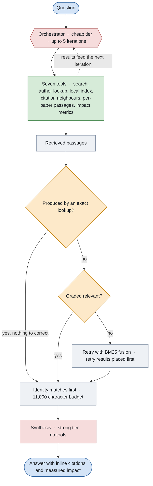
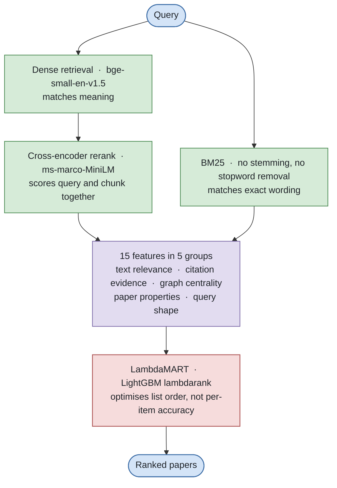
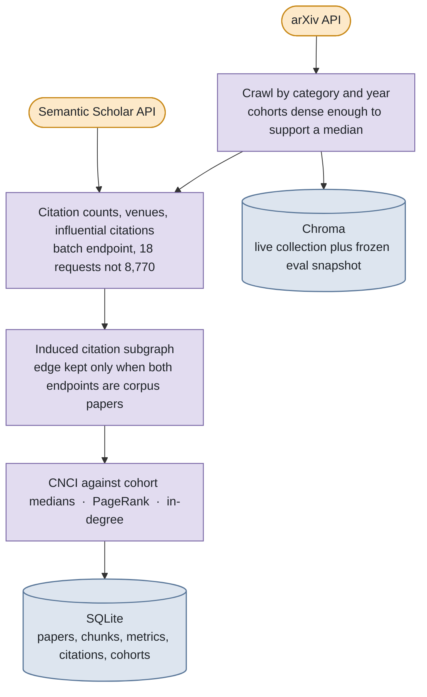

# Paper Agent

A research assistant for academic literature. Ask for a paper by name, by author, or by
topic; get a citation-grounded answer with measured impact figures attached, not
adjectives.

Built as a year-long capstone project. Runs entirely on free API tiers and local
embedding models.

## What makes it different from a plain RAG pipeline

Text similarity cannot tell the difference between a paper and a paper *about* that
paper. Asked for "the original transformer paper", a cross-encoder reranker promotes a
survey whose abstract narrates the Transformer's existence over the paper itself, whose
abstract never contains its own title.

This project adds **citation evidence** to retrieval to resolve exactly that:

- **Field-normalized impact (CNCI)** - citations relative to the median paper of the
  same field and year, because a raw citation count mostly measures a paper's age.
- **PageRank over the citation graph** - being cited *by* influential papers, which is
  not the same as being cited often.
- **Co-citation and bibliographic coupling** - related work found through citation
  structure rather than wording.
- **A learned ranker (LambdaMART)** over text and citation features, because a fixed
  citation weight trades accuracy on famous papers against accuracy on everything
  else. Only a model that conditions on the query can have both.

Every figure shown to the user is measured, and anything that could not be computed is
reported as such rather than as zero.

## Architecture

### How a question becomes an answer

A cheap model decides which tools to call; a stronger one writes the answer from the
passages those tools actually returned. Splitting them keeps the model doing the writing
from being distracted by tool-call bookkeeping, and holds the expensive tier to one call
per question.



| Tool | What it is for |
| --- | --- |
| `search_papers` | Discover papers on arXiv and Semantic Scholar, with a title-match tier so a paper *about* a title is never presented as the paper itself |
| `search_by_author` | Everything by one researcher, newest first, optionally within a year range |
| `query_index` | Semantic search over the local corpus, ordered by the learned ranker |
| `find_related_papers` | Neighbours by citation structure rather than wording: co-citation, and bibliographic coupling for papers too new to have been cited |
| `get_paper_passages` | The relevant passages from each of several papers separately, so one long paper cannot supply the whole comparison |
| `get_paper_metrics` | Citation impact, field-normalised multiple, network centrality percentile |
| `ingest_full_text` | Fetch and index a paper's full text on demand |

The gate matters more than it looks. Corrective RAG exists to catch retrieval that
*missed*, but a lookup by author name or paper id cannot have missed in that sense, so
grading it only creates chances to discard a correct answer. Asked what a given
researcher had published, the grader once rejected their own papers because an abstract
does not list its own authors, and the retry replaced them with similar-sounding work by
other people.

### Retrieval and ranking

The part the project exists to test. Text similarity cannot distinguish a paper from a
paper about it, so citation evidence enters as ranking features rather than as a filter.



A learned ranker rather than a tuned weight, because the measurements ruled the weight
out. Every fixed citation weight that helped queries seeking foundational papers hurt
queries seeking specific niche work, monotonically in both directions, so no single point
on that trade-off is acceptable. A gradient-boosted tree can express what a weight
cannot: trust the text score when a query names a paper precisely, reach for centrality
when it describes one instead.

### Where the citation evidence comes from



Normalisation is not optional here. The median 2017 paper in this corpus has 30
citations; the median 2025 paper has 1. Ranking on raw counts ranks by age, which is why
every impact figure shown is divided by its own cohort's median, and why a cohort too
small to trust a median reports nothing at all rather than a zero.

## Setup

### Backend

```bash
cd backend
python3 -m venv .venv
source .venv/bin/activate
pip install -r requirements.txt
cp .env.example .env
```

Then run it:

```bash
uvicorn app.main:app --reload
```

### Frontend

```bash
cd frontend
npm install
npm run dev
```

The UI expects the API on `http://localhost:8000`; override with
`NEXT_PUBLIC_API_URL`.

## API keys

All optional, all free. The LLM router tries providers in order and falls through on
rate limits, so one key is enough to start.

| Variable | Purpose |
| --- | --- |
| `GROQ_API_KEY` | preferred LLM provider |
| `GEMINI_API_KEY` | fallback LLM provider |
| `OPENROUTER_API_KEY` | second fallback |
| `S2_API_KEY` | Semantic Scholar |

**`S2_API_KEY` is worth more than it looks.** Unauthenticated Semantic Scholar access is
currently limited to the batch endpoint; every search endpoint returns HTTP 429. Since
Semantic Scholar is the only source here covering IEEE, Springer, Elsevier and ACM, the
key is what makes non-arXiv papers findable by title. Without it the system still works,
but it can only discover papers that have an arXiv preprint. The key is free from the
Semantic Scholar API page.

## Building the corpus

The app works immediately, ingesting papers as it discovers them. The scientometric
features need a corpus with citation metrics behind them:

```bash
cd backend
python -m scripts.build_corpus --stage all
```

Stages run independently (`seed`, `arxiv`, `metrics`, `graph`, `cohorts`, `index`,
`snapshot`) so an interrupted run resumes rather than restarting. Expect a few hours,
most of it waiting on API rate limits.

Then train the ranker:

```bash
python -m scripts.build_training_set
python -m scripts.train_ranker
```

## Evaluation

```bash
python -m scripts.evaluate --systems dense-only learned   # score retrieval configurations
python -m scripts.evaluate --validate                     # check the eval set is well-formed
python -m scripts.ablate --seeds 8                        # feature ablation and noise floor
python -m scripts.regression                              # can we still find specific papers
```

Two separate things, deliberately:

- `scripts.evaluate` and `scripts.ablate` measure **ranking quality** against a frozen
  snapshot of the vector store, so numbers stay comparable over time.
- `scripts.regression` checks that **specific named papers** are still retrievable from
  the live index, using the wording a real person would type. It exits non-zero on a
  miss.

Always read `--seeds` output alongside any ablation number. Retraining the same
configuration under different train/validation splits moves the score by more than most
feature-group differences, so a difference smaller than that spread is not a result.

## Layout

```
backend/app/
  ingestion/        arXiv and Semantic Scholar clients, PDF parsing, embeddings,
                    hybrid dense + BM25 retrieval
  scientometrics/   CNCI cohorts, PageRank, co-citation, impact scorecards
  ranking/          feature extraction, LambdaMART model, inference path
  evaluation/       nDCG / recall / MRR, eval harness
  llm/              provider-fallback router, tool-calling agent, grading
  storage/          SQLite metadata, Chroma vectors
  routes/           FastAPI endpoints
backend/scripts/    corpus build, training, evaluation, ablation, regression
frontend/           Next.js app
docs/PROJECT.md     full specification
```
